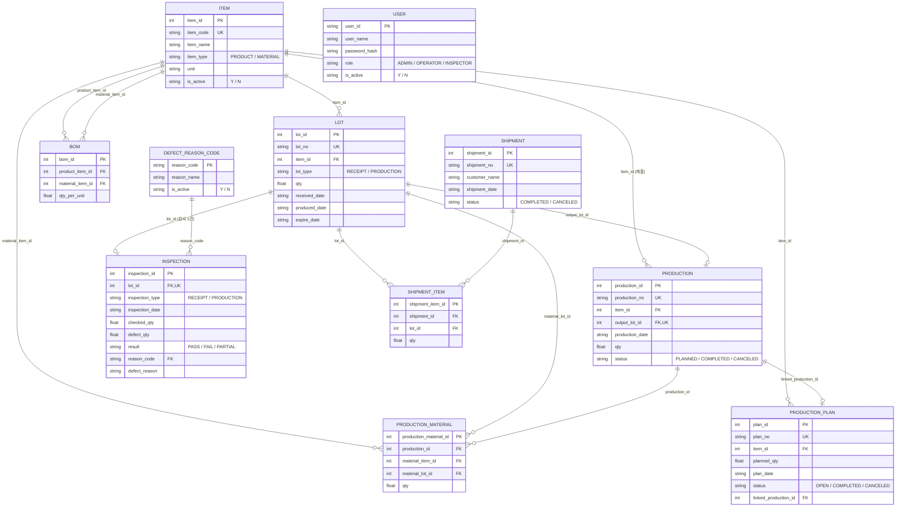

# 라면공장 Mini MES 발표

---

## 1. 개요

MES는 Manufacturing Execution System의 줄임말로, 원자재가 들어와서 제품이 만들어지고 출하되기까지 전 과정을 관리하는 시스템. 실제 공장에서 쓰는 시스템을 소규모로 구현.

---

## 2. 문제 제기 / 만든 이유

라면공장을 예로 들면, 실무에서는 이런 질문에 답할 수 있어야 함

- "지금 원자재 재고가 얼마나 남았지?"
- "이 제품 100박스 만들려면 원자재가 얼마나 필요하지?"
- "이 원자재에 문제가 생겼는데, 어떤 제품에 들어갔지?"
- "불량품이 실수로 출하되지는 않았을까?"

엑셀로 관리하면 실수가 생기기 쉽고, 추적도 어려움. 그래서 데이터베이스 기반으로 이 흐름을 체계적으로 관리하는 시스템이 필요

---

## 3. 시스템 구조

**기술 스택**

- 프론트엔드/전체 앱: Python + Streamlit
- 데이터베이스: SQLite
- 인증: 아이디/비밀번호 해시(SHA-256) 기반 로그인

**핵심 데이터 흐름**

```
품목 등록 → 원자재 입고 → BOM(표준배합) 등록 → 생산계획 → 생산 등록 → 불량검사 → 출하
```

이 전체 흐름이 하나의 시스템 안에서 이어지고, 중간중간 LOT(묶음) 단위로 추적이 가능하도록 설계.

### 3-1. 데이터 모델 (ERD)

라면공장 Mini MES의 전체 테이블 구조와 관계.



### 3-2. 역할별 접근 권한

| 페이지 | ADMIN🛡️ | OPERATOR⚙️ | INSPECTOR🔍 |
|---|:---:|:---:|:---:|
| 품목 관리 | ✅ | ✅ | ✅  | 🛡️⚙️🔍  |
| BOM 관리 | ✅ | ✅ | ❌ | 🛡️⚙️  |
| 원자재 입고 등록 | ✅ | ✅ | ❌ | 🛡️⚙️  |
| LOT 조회 | ✅ | ✅ | ✅ | 🛡️⚙️🔍  |
| 생산계획 | ✅ | ✅ | ❌ | 🛡️⚙️  |
| 생산 등록 | ✅ | ✅ | ❌ | 🛡️⚙️  |
| 생산실적 조회 | ✅ | ✅ | ✅ | 🛡️⚙️🔍  |
| 불량검사 | ✅ | ❌ | ✅ | 🛡️🔍  |
| 출하 관리 | ✅ | ✅ | ❌ | 🛡️⚙️  |
| LOT 추적 | ✅ | ✅ | ✅ | 🛡️⚙️🔍  |
| 재고 현황 | ✅ | ✅ | ✅ | 🛡️⚙️🔍  |
| 사용자 관리 | ✅ | ❌ | ❌ | 🛡️  |

역할에 따라 필요한 화면만 보이도록 홈 메뉴와 페이지 접근을 함께 제한. (INSPECTOR은 조회만 가능)

---

## 4. 라이브 데모 순서


### (1) 로그인

- 계정 기반 로그인 화면
- "실사용을 고려해서 아이디/비밀번호는 데이터베이스에 암호화(해시)해서 저장."

### (2) 품목 관리

- 원자재/제품 목록 조회 → 신규 등록 탭
- "면, 스프, 면발 등의 새 원자재나 제품을 등록."

### (3) BOM(표준 배합) 등록

- 제품 하나를 골라 원자재 구성비 등록
- "라면 1박스를 만들 때 면발이 몇 kg, 스프가 몇 g 필요한지 미리 정의. 레시피라고 보시면 됨."

### (4) 원자재 입고 등록

- 원자재 하나를 골라 입고 등록
- "입고할 때마다 LOT 번호가 자동으로 부여, 나중에 이 LOT 단위로 추적이 가능."

### (5) 생산계획 → 재고 부족 확인

- 생산계획 등록 후, "계획 대비 원자재 부족 확인" 탭으로 이동
- "계획한 수량을 만들기에 재고가 충분한지 미리 확인 가능. 부족하면 빨간색으로 바로 표시." 

### (6) 생산 등록

- 계획에서 불러오기로 자동 채움 → 저장
- "BOM 덕분에 필요한 원자재 양이 자동으로 계산."
- 저장 후 홈 화면으로 이동하면 생산 실적이 반영된 걸 볼 수 있음.

### (7) 불량검사

- 방금 생산한 LOT를 검사 등록 (PASS 또는 FAIL 선택)
- "불량 사유도 코드로 관리해서, 나중에 통계를 낼 때 '포장 손상'과 '포장 불량'처럼 표기가 갈리는 문제 막음."

### (8) 출하 관리

- FAIL로 처리했던 LOT를 출하 목록에서 선택 시도
- "불합격 판정된 제품은 시스템이 자동으로 출하를 막아버림. 사람이 실수로 놓쳐도 시스템이 걸러주는것." 

### (9) LOT 추적

- 특정 원자재 LOT를 골라 정방향 추적
- "이 원자재가 어떤 완제품에 들어갔는지 한 번에 조회. 만약 원자재에 문제가 생기면, 어떤 제품을 회수해야 하는지 바로 알 수 있음."

### (10) 재고 현황 대시보드


- 잔량, 유효기한 임박 LOT 확인
- "한눈에 재고 상태를 볼 수 있는 대시보드."

---

## 5. 마무리 / 확장 가능성

지금은 라면공장을 예로 만들었지만, 이 구조(품목-LOT-생산-검사-출하)는 업종에 크게 상관없이 재사용할 수 있게 설계. 나중에 자동차 부품처럼 다른 업종으로도 확장할 계획.

---

## 6. Q&A

| Q | A |
|---|---|
| 왜 SQLite를 썼나요? | 소규모 시스템이라 별도 서버 없이 파일 하나로 관리 가능해서. 실제 운영 규모라면 PostgreSQL 등으로 전환 가능. |
| 동시에 여러 명이 쓰면 문제없나요? | 트랜잭션(BEGIN IMMEDIATE)으로 재고 차감 시 경쟁 상태를 방지하도록 설계. |
| 재고는 어떻게 계산하나요? | 별도 재고 테이블 없이, "총입고량 - 총사용량"을 매번 계산하는 방식. 이력 추적이 용이. |
| 왜 완제품 LOT에 유효기한이 있나요? | 라면 같은 식품 특성상 유효기한 관리가 필수라서 넣었고, 다른 업종 전환 시엔 선택 항목으로 둘 예정. |
| 보안은 어떻게 처리했나요? | 비밀번호는 평문 저장 없이 솔트+SHA-256 해시로 저장. |
| 왜 OPERATOR와 INSPECTOR 권한을 나눴나요? | 검사자가 실수로 생산·입고 데이터를 건드리지 않게, 작업자가 검사 판정에 관여하지 않게 역할별로 화면 자체를 분리. |
| 생산계획과 실제 생산은 어떻게 연결되나요? | production 테이블은 output_lot_id가 필수라 아직 실물이 없는 계획을 못 담아서, 별도 production_plan 테이블로 분리. 생산 등록 시 계획을 선택하면 자동으로 계획이 COMPLETED로 전환되며 연결됨. |
| BOM은 왜 필요한가요? | 제품 1단위당 원자재 소요량을 미리 정의해두면, 생산수량만 입력해도 필요한 원자재 양과 부족 여부가 자동 계산됨. 사람이 매번 계산할 필요가 없어짐. |
| 불합격(FAIL) LOT는 어떻게 막나요? | 출하 등록 시 선택한 LOT의 검사 결과를 다시 조회해서, FAIL이면 서버(백엔드) 단에서 저장 자체를 막음. 화면에서 실수로 선택해도 최종적으로 차단됨. |

---
