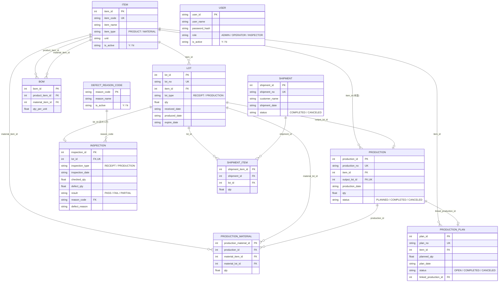

# Mini MES 데이터베이스 스키마

라면공장 Mini MES의 전체 테이블 구조와 관계입니다. 이 블록은 GitHub에서
README.md에 그대로 붙여넣으면 자동으로 다이어그램으로 렌더링됩니다.

```mermaid
erDiagram
    ITEM ||--o{ LOT : "item_id"
    ITEM ||--o{ PRODUCTION : "item_id (제품)"
    ITEM ||--o{ PRODUCTION_MATERIAL : "material_item_id"
    ITEM ||--o{ BOM : "product_item_id"
    ITEM ||--o{ BOM : "material_item_id"
    ITEM ||--o{ PRODUCTION_PLAN : "item_id"

    LOT ||--o| PRODUCTION : "output_lot_id"
    LOT ||--o{ PRODUCTION_MATERIAL : "material_lot_id"
    LOT ||--o| INSPECTION : "lot_id (검사 1건)"
    LOT ||--o{ SHIPMENT_ITEM : "lot_id"

    PRODUCTION ||--o{ PRODUCTION_MATERIAL : "production_id"
    PRODUCTION ||--o| PRODUCTION_PLAN : "linked_production_id"

    DEFECT_REASON_CODE ||--o{ INSPECTION : "reason_code"

    SHIPMENT ||--o{ SHIPMENT_ITEM : "shipment_id"

    ITEM {
        int item_id PK
        string item_code UK
        string item_name
        string item_type "PRODUCT / MATERIAL"
        string unit
        string is_active "Y / N"
    }

    LOT {
        int lot_id PK
        string lot_no UK
        int item_id FK
        string lot_type "RECEIPT / PRODUCTION"
        float qty
        string received_date
        string produced_date
        string expire_date
    }

    PRODUCTION {
        int production_id PK
        string production_no UK
        int item_id FK
        int output_lot_id FK, UK
        string production_date
        float qty
        string status "PLANNED / COMPLETED / CANCELED"
    }

    PRODUCTION_MATERIAL {
        int production_material_id PK
        int production_id FK
        int material_item_id FK
        int material_lot_id FK
        float qty
    }

    BOM {
        int bom_id PK
        int product_item_id FK
        int material_item_id FK
        float qty_per_unit
    }

    INSPECTION {
        int inspection_id PK
        int lot_id FK, UK
        string inspection_type "RECEIPT / PRODUCTION"
        string inspection_date
        float checked_qty
        float defect_qty
        string result "PASS / FAIL / PARTIAL"
        string reason_code FK
        string defect_reason
    }

    DEFECT_REASON_CODE {
        string reason_code PK
        string reason_name
        string is_active "Y / N"
    }

    PRODUCTION_PLAN {
        int plan_id PK
        string plan_no UK
        int item_id FK
        float planned_qty
        string plan_date
        string status "OPEN / COMPLETED / CANCELED"
        int linked_production_id FK
    }

    USER {
        string user_id PK
        string user_name
        string password_hash
        string role "ADMIN / OPERATOR / INSPECTOR"
        string is_active "Y / N"
    }

    SHIPMENT {
        int shipment_id PK
        string shipment_no UK
        string customer_name
        string shipment_date
        string status "COMPLETED / CANCELED"
    }

    SHIPMENT_ITEM {
        int shipment_item_id PK
        int shipment_id FK
        int lot_id FK
        float qty
    }
```
